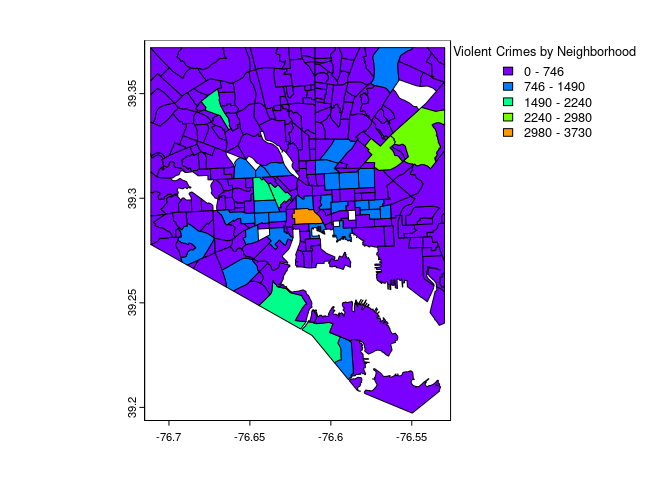
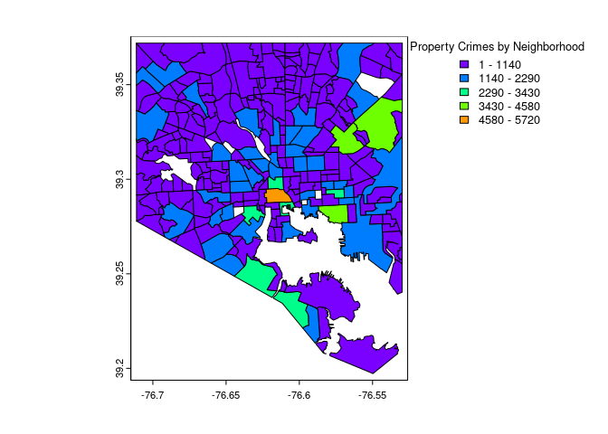

# Team Crime Patrol FIRE Summit Presentation
Esha Shah, Advik Sachdeva, Sreeja Yellapragada, Kush Vachher, Alan
Zhang, Brian Mark Crimy

## Research Question

How does the air pollution rate impact the violent crime rate in
Baltimore City? 


## Data Wrangling

**Outcome variable**

Our outcome variable is the crime rates in specific neighborhoods.

The data comes from the Baltimore Police Department as part of Open Data
Baltimore.<https://data.baltimorecity.gov/datasets/part-1-crime-data/explore>

We categorized each of the crime entries into property crimes and
violent crimes, and then organized them by date, as shown in the code
below.

Then we visualized the violent and property crimes by neighborhood shown
on the graphs below. The graphs represent the crime levels of the
different types of crime, sorted by neighborhood.





**Treatment variable**

The treatment variable is an indicator of whether there is wind in each
county. We distinguished this by separating each date-neighborhood with
a 0 or 1. A 0 meant there was no wind flowing in the direction of that
county, ergo no pollution that day. Similarly, a 1 meant there was wind
flowing in that direction, ergo pollution was present.

This data was obtained by NASA MERRA Data.

In this code, we first found the angle of each county using the
coordinate points from our data. Then, we converted the angles to
degrees. Finally, we categorized whether or not the county had wind
flowing in its direction with a zero or one using a if else statement.

``` r
{r}

#| eval: false
#| echo: false

library("terra")
library("tidyterra")

all<-read.csv("full_merge.csv") %>%
  rename(Name=Neighborhood) %>%
  mutate(wind_dir=atan2(ULML, VLML)*(180/pi))

all2<-merge(df2, all, by="Name")%>%
  mutate(treatment = ifelse(wind_dir > min_ang & wind_dir< max_ang, 1, 0)) %>%
  filter(!is.na(treatment)) %>%
  select(-X.x, -X.y, -ang1, -ang2, -n1x, -n2x, -n1y, -n2y, -ULML, -VLML)

write.csv(all2, "finaldata.csv", row.names = F)

test<-all2 %>%
  select(min_ang, max_ang, wind_dir) %>%
  mutate(in_dir = ifelse(wind_dir > min_ang & wind_dir< max_ang, 1, 0))
```

**Control variables**

The control variables we have taken into account are certain
neighborhood characteristics such as the majority race and gender of the
neighborhood.

The code below demonstrates the merging between the data sets of crime
by race, neighborhood, and date.

``` r
library("tidyverse")
library("dplyr")

intersect<-read.csv("road_neighborhood_intersect.csv")
race<-read.csv("crime_by_race.csv")
race2 = subset(race, select = -c(X))
intersect2<-intersect %>%
  mutate(Neighborhood = toupper(ndf))
colnames(intersect2)[3] <- "intersects_with_road"
intersect3 = subset(intersect2, select = -c(X, ndf))
crime_by_race_date_intersect <- full_join(race2, intersect3, by = "Neighborhood")
```

## Preliminary Results

This graph shows the average amount number of violent crimes per day for
20 random counties in the dataset, on days where there was
wind/pollution (blue) and days where there was no wind/no pollution
(red).


